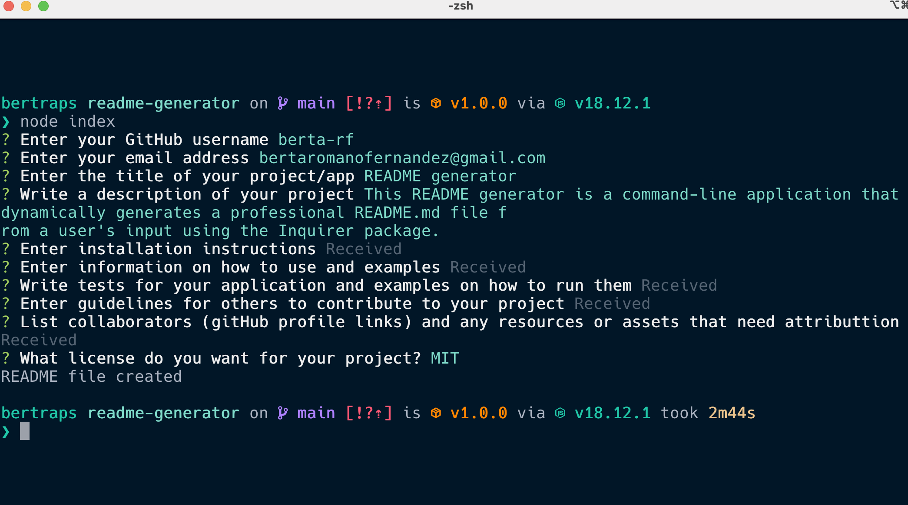

# README Generator


## 🎯 Description

This README generator is a command-line application that dynamically generates a professional README.md file from a user's input using the Inquirer package.


## Table of Contents

- [🛠 Installation](#-installation)
- [💻 Usage](#-usage)
- [🔍 Tests](#-tests)
- [💬 Questions](#-questions)
- [🤝 Credits](#-credits)
- [💪 Contributing](#-contributing)
- [📖 License](#-license)


### 🛠 Installation

To use this application you will need to install dependencies by entering the following command on your terminal:

```
npm install
```


### 💻 Usage

The application is invoked by entering the following command on your terminal:

```
node index.js
```

The questions regarding installation, contributing, tests, usage and credits are editor prompts, and they launch an instance of the users preferred editor on a temporary file. Once the user exits their editor, the contents of the temporary file are read in as the result. The editor to use is determined by reading the $VISUAL or $EDITOR environment variables. If neither of those are present, notepad (on Windows) or vim (Linux or Mac) is used.

If they open in vim, to start writing press ``i``. When you are done editing press ``Ctrl + c`` followed by ``:wq`` and your input will be saved.

In the Usage section, there’s a placeholder for an App screenshot. If you want a screenshot image to add automatically to your README, make sure you have an assets folder in your main directory with a subfolder images with an image named ``screenshot.png`` in it.

  


[Click here for a walkthrough video of the app](https://drive.google.com/file/d/1Yrybqn1N41OLQXA-ls77VCC1xrVq8M_K/view?usp=share_link)


### 🔍 Tests

You can install a package with functional testing for inquirer.js:

```
npm i inquirer-test
```

Read the documentation on [inquirer-test](https://www.npmjs.com/package/inquirer-test)


## 💬 Questions

Contact me if you have any questions!

- Drop me an email [bertaromanofernandez@gmail.com](mailto:bertaromanofernandez@gmail.com)
- Check out my GitHub profile [berta-rf](https://github.com/berta-rf)


### 🤝 Credits

* [Inquirer package](https://www.npmjs.com/package/inquirer)
* [Shields.io](https://shields.io/)
* [fs.writeFile() in Node.js](https://www.geeksforgeeks.org/node-js-fs-writefile-method/)


### 💪 Contributing

Contributions are what make the open source community such an amazing place to learn, inspire, and create. Any contributions you make are **greatly appreciated**.

If you have a suggestion that would make this better, please fork the repo and create a pull request. You can also simply open an issue with the tag "enhancement".

1. Fork the Project
2. Create your Feature Branch (`git checkout -b feature/AmazingFeature`)
3. Commit your Changes (`git commit -m 'Add some AmazingFeature'`)
4. Push to the Branch (`git push origin feature/AmazingFeature`)
5. Open a Pull Request


### 📖 License

This project is licensed under the terms of the **MIT License**. See [LICENSE](LICENSE) for more information.


